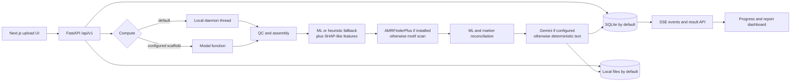

# Project handoff: E. coli ciprofloxacin genomic AST

## Executive summary

This is a research-use-only MVP that accepts an *Escherichia coli* FASTA/FASTQ file and returns a ciprofloxacin genomic antimicrobial-susceptibility (AST) report. The end-to-end upload, asynchronous analysis, progress streaming, persisted result, and dashboard paths are implemented. The current defaults are designed for a local demonstration, not clinical care or public-health reporting.

The most important caveat is scientific: a complete report does **not** mean a validated prediction. Unless verified AMRpredictor weights and their exact training-time preprocessing are installed, the backend uses heuristic probabilities, synthetic SHAP-like explanations, lightweight marker motifs, and deterministic text. The bundled validation table and scores are demo fixtures. Do not use any output to diagnose, treat, or report a patient.

Repositories:

- [frontend-nextjs](https://github.com/Asadyousaf03/frontend-nextjs) — Next.js user workflow and report dashboard
- [backend-fastapi](https://github.com/Asadyousaf03/backend-fastapi) — API, persistence, pipeline, compute adapters, and validation harness

## How the system works



1. The browser creates an upload slot, uploads content, and creates an analysis.
2. FastAPI records upload/analysis metadata. Local mode stores bytes under `data/uploads/` and records state/events in SQLite.
3. Compute runs in a daemon thread by default. `COMPUTE_BACKEND=modal` attempts a Modal spawn, but falls back silently to local compute if dispatch fails.
4. QC checks basic format, sequence length, GC, N50, and a heuristic *E. coli* confidence. FASTA assemblies pass through; FASTQ uses SPAdes/Flye when available or a pseudo-assembly fallback.
5. The pipeline extracts 3/4/5-mer frequencies, attempts XGBoost inference, scans resistance evidence, reconciles ML and marker calls, and creates an interpretation.
6. Events are persisted and streamed over SSE; the frontend also polls status every two seconds. The completed JSON report shows QC, R/S call, variants, explanations, alternatives, sequence context, and pipeline metadata.

## What is complete

**Frontend**

- Typed upload → analysis → SSE/polling → result workflow with cleanup via `AbortController`.
- Responsive report dashboard for susceptibility, QC, marker evidence, explanations, alternatives, and QRDR/sequence context.
- Deliberate light/dark theme, semantic R/S/ATU colors, error states, progress stages, and visible research disclaimer.
- API base URL is environment-configurable.

**Backend**

- Versioned upload, analysis, status, SSE, and result endpoints plus `/health`; legacy `/api/analyze` is deprecated.
- SQLAlchemy records for uploads, analyses, and ordered progress events; SSE supports `Last-Event-ID`.
- Local storage, S3 presign scaffolding, local-thread compute, and Modal dispatch scaffolding.
- Basic QC, SPAdes/Flye hooks, k-mer feature extraction, optional XGBoost loading, optional AMRFinderPlus parsing, rule reconciliation, optional Gemini structured output, and deterministic fallbacks.
- Result JSON includes pipeline versions and whether pretrained weights were loaded.

**Infrastructure**

- Render blueprint, CORS configuration for local/Vercel origins, Modal app definition, and frontend Vercel-compatible API configuration.
- Environment-backed database, storage, compute, model, CORS, upload-size, and Gemini settings.

**Validation**

- A lineage-aware split and metric harness covering AUC, balanced accuracy, MCC, sensitivity, specificity, precision, F1, and calibration error.
- Explicit ATU exclusion/reporting behavior in the harness.
- Demo FASTA files and an end-to-end backend smoke script.

## Local setup and demo

See the [frontend README](https://github.com/Asadyousaf03/frontend-nextjs#readme) and [backend README](https://github.com/Asadyousaf03/backend-fastapi#readme) for the maintained setup notes.

Backend (PowerShell):

```powershell
cd D:\Projects\backend-fastapi
python -m venv .venv
.\.venv\Scripts\Activate.ps1
pip install -r requirements.txt
copy .env.example .env
uvicorn main:app --reload --port 8001
```

Frontend (a second PowerShell terminal):

```powershell
cd D:\Projects\frontend-nextjs
npm install
"NEXT_PUBLIC_API_URL=http://localhost:8001" | Set-Content .env.local
npm run dev
```

Open `http://localhost:3000`, then upload one of:

- `D:\Projects\backend-fastapi\data\samples\demo_ecoli_cipro_r.fasta`
- `D:\Projects\backend-fastapi\data\samples\demo_ecoli_cipro_s.fasta`

Backend-only checks:

```powershell
cd D:\Projects\backend-fastapi
.\.venv\Scripts\Activate.ps1
python scripts/e2e_demo.py
python -m validation.run_validation
```

Frontend checks:

```powershell
cd D:\Projects\frontend-nextjs
npm run lint
npm run build
```

Key environment variables:

- Frontend: `NEXT_PUBLIC_API_URL` (set to `http://localhost:8001` locally).
- Backend: `DATABASE_URL`, `STORAGE_BACKEND`, `LOCAL_STORAGE_PATH`, `PUBLIC_API_BASE`, `COMPUTE_BACKEND`, `AMRPREDICTOR_MODEL_DIR`, `ENABLE_DEMO_FALLBACK`, `CORS_ORIGINS`, `CORS_ORIGIN_REGEX`, `GEMINI_API_KEY`, `GEMINI_MODEL`, `MAX_UPLOAD_BYTES`, and `S3_*`.
- Keep `.env`, `.env.local`, databases, uploads/results, model binaries, credentials, caches, and generated build artifacts out of Git.

## Reality check

| Area | Current status | Needed for real use |
|---|---|---|
| Scope | *E. coli* + ciprofloxacin only | Preserve this claim until other organism/drug pairs are independently validated |
| Prediction | Tries a local XGBoost file; otherwise always falls back to a hand-built probability | Obtain authentic weights, pin checksums, and reproduce exact feature vocabulary/order and preprocessing |
| Explanations | Values are constructed from marker presence and k-mer frequency; the SHAP package is not used for model explanations | Compute and verify SHAP against the loaded production model |
| AMR evidence | AMRFinderPlus runs only when `amrfinder` is installed; otherwise short motif scanning is used | Pin AMRFinderPlus database/tool versions and add a real deterministic PointFinder/ResFinder path |
| QC/species | Lightweight parser, length/GC heuristics, and a soft species gate | Use validated FASTA/FASTQ parsing, read/assembly QC, contamination checks, and taxonomic identification |
| Assembly | SPAdes/Flye hooks exist; missing tools produce a pseudo-FASTA from reads | Containerize pinned assemblers and fail clearly when required processing is unavailable |
| Interpretation | Gemini is optional and exceptions fall back to deterministic text | Treat generated prose as presentation only; validate evidence grounding and retain deterministic safety text |
| Validation | Bundled eight-row fixture and label-derived pseudo-scores are for demo/CI only | Run locked, reproducible external validation; current metrics are not evidence of performance |
| Breakpoints | Output labels `EUCAST v16.1`; ATU is mentioned but genotype output remains binary R/S | Govern EUCAST/CLSI version, phenotype mapping, ATU policy, provenance, and update review |
| Persistence | SQLite and local files are defaults | Use managed Postgres and object storage with migrations, retention, encryption, and backups |
| Modal/S3 | Adapters are scaffolds. Modal needs shared reachable DB/storage/code/tools; the browser S3 upload and pipeline retrieval path are not end-to-end verified | Build and test a containerized remote path with object-store download/upload, secrets, retries, and no silent local fallback |
| Reliability/security | Health, CORS, SSE, and basic size limits exist; no auth, authorization, rate limits, audit policy, malware/content validation, job recovery, or full telemetry | Add operational and security controls before handling sensitive or untrusted data |

`ENABLE_DEMO_FALLBACK` is documented but currently does not disable the ML/marker/assembly fallbacks. A production mode must fail closed when required weights or tools are missing.

## Prioritized roadmap

### P0 — establish scientific truth and fail-safe execution

1. **External lineage-aware validation.** Freeze independent assemblies, MIC/AST labels, lineage metadata, deduplication rules, exclusions, and splits. Acceptance: one command in a pinned container reproduces sample counts and 95% confidence intervals for sensitivity, specificity, balanced accuracy, MCC, calibration, very-major error, major error, and ATU-stratified results; no isolate/lineage leakage; immutable dataset/model hashes are reported.
2. **Real AMRpredictor integration.** Verify Zenodo artifact provenance, weights, feature extraction, feature order, missing-feature behavior, thresholds, and calibration against the authors' reference outputs. Acceptance: checksum-pinned weights and golden isolates match expected feature vectors and probabilities within declared tolerances; startup fails closed when production assets mismatch.
3. **Deterministic AMR tools.** Install and pin AMRFinderPlus plus PointFinder/ResFinder databases in the runtime image. Acceptance: version/database hashes appear in every result; resistant/susceptible golden fixtures produce stable parsed evidence across repeated runs; tool failure cannot masquerade as “no marker.”
4. **Breakpoint governance.** Implement reviewed EUCAST and/or CLSI policies, versioned independently of code. Acceptance: each call records standard/version/date, MIC mapping and ATU handling have boundary tests, and an approved update procedure plus rollback exists.
5. **Safe deployment path.** Containerize API and compute, including assemblers and AMR tools; make Modal/object storage/database connectivity explicit. Acceptance: a clean deployment processes FASTA and supported FASTQ fixtures end to end, survives worker restart, retries idempotently, and never silently changes compute or analysis mode.

### P1 — make it operable with governed data

1. Move to migrated Postgres and S3-compatible object storage. Acceptance: concurrent-job tests, presigned upload/download integration, backup/restore drill, retention/deletion policy, encryption, and checksums pass.
2. Add structured logs, traces, metrics, alerting, job heartbeats/timeouts, dead-letter/retry handling, and result provenance. Acceptance: dashboards and alerts expose stage latency, failures, fallback/tool/model versions, queue depth, and a correlation ID without sequence content.
3. Add authentication, authorization, tenant isolation, rate/size limits, secret management, audit trails, dependency/image scanning, and threat modeling. Acceptance: security tests prove users cannot access another user's uploads/results and no genomic or patient data appears in logs.
4. Establish data governance. Acceptance: consent/lawful-basis, de-identification, residency, access, retention/deletion, incident response, data-use agreements, and public-health reporting responsibilities are reviewed and documented.

### P2 — demonstrate impact responsibly

1. Conduct multi-site retrospective clinical validation across geography, lineage, platform, sample quality, and prevalence shifts. Pre-register endpoints and compare against phenotypic AST and current molecular methods.
2. Run prospective silent-mode pilots with microbiology/public-health teams. Acceptance: turnaround time, failure rate, discordance adjudication, calibration drift, workflow fit, and equity/subgroup performance meet pre-agreed thresholds without influencing care.
3. Define intended use and complete quality, clinical-risk, regulatory, and post-market plans with qualified experts. Acceptance: the applicable jurisdictional pathway, human oversight, change control, CAPA, model/database updates, and surveillance are approved before any clinical claim.

## Starting points for new contributors

1. Replace the validation pseudo-scores with predictions from a checksum-pinned model and add golden feature/probability fixtures.
2. Add explicit `demo` versus `production` modes; production must reject missing weights, assemblers, databases, or unsupported/compressed inputs.
3. Build a pinned container and deterministic AMRFinderPlus/PointFinder integration before extending the UI.
4. Add automated tests for upload limits/content, FASTA/FASTQ parsing, SSE replay/termination, analysis state transitions, tool failures, model mismatch, reconciliation boundaries, ATU boundaries, and cross-service contracts.
5. Prove Postgres/S3/remote-compute behavior in an ephemeral integration environment, then add observability and security controls.

Testing expectations:

- Unit tests cover parsers, thresholds, evidence mapping, fallback prohibition, and schema serialization.
- Contract tests keep backend OpenAPI/Pydantic schemas and `types/genomic.ts` aligned.
- Integration tests run upload → storage → compute → SSE → result for R, S, ATU, malformed, wrong-species, tool-failure, and restart cases.
- Scientific regression tests pin inputs, model/tool/database versions, expected outputs, and numeric tolerances.
- UI tests cover failure/reconnect, accessibility, responsive layout, and clear display of provenance and limitations.

Definition of done for any analysis-path change:

- No unlabelled fallback or silent backend switch; provenance and versions are visible in the result.
- Automated tests and documented reproduction commands pass from a clean environment.
- Failure behavior, security/privacy impact, and scientific impact are reviewed.
- Contracts and both READMEs/handoff are updated when setup, behavior, or claims change.
- No secrets, uploads, databases, model binaries, caches, or build artifacts are committed.

## Known limitations and safety

- Research use only; not a clinical diagnostic, treatment recommendation, surveillance report, or substitute for phenotypic AST.
- Current bundled samples, validation data, probabilities, explanations, species checks, and fallback markers are demonstrations.
- Novel lineages, mixed/contaminated samples, low-quality data, unsupported compression, incomplete assemblies, and preprocessing mismatch can yield incorrect or misleading results.
- A susceptible genomic prediction cannot rule out resistance mechanisms absent from the model/databases; a resistant prediction still requires appropriate confirmation and interpretation.
- Alternative-drug text is not patient-specific and does not account for infection site, dose/exposure, allergies, interactions, local formulary, or current guidelines.
- Do not upload identifiable patient data until governance, security, access control, retention, and incident-response requirements are implemented and approved.

## Repository map and ownership

Frontend owns presentation and browser orchestration, not scientific decisions:

```text
frontend-nextjs/
  app/page.tsx                 Upload, SSE/polling, terminal-state orchestration
  components/                  Upload, progress, report, theme, sequence views
  lib/api.ts                   Typed HTTP/EventSource client and API base URL
  lib/qrdr.ts                  Display-oriented QRDR sequence context
  types/genomic.ts             Mirror of backend response/request contracts
```

Backend is the source of truth for jobs, scientific computation, provenance, and policy:

```text
backend-fastapi/
  main.py, config.py           App, CORS, health, environment settings
  routes/                      Upload, analysis, SSE, and result endpoints
  db/                          SQLAlchemy records and sessions
  services/pipeline.py         Stage orchestration and result persistence
  services/qc.py               Current lightweight QC/species heuristic
  services/assembly.py         FASTA pass-through, SPAdes/Flye hooks, fallback
  services/features.py         Current k-mer feature extraction
  services/ml_core.py          Model loading, probability, explanations, reconciliation
  services/rules.py            AMRFinderPlus parser and marker fallback
  services/llm.py              Gemini structured interpretation and deterministic fallback
  services/storage.py          Local storage and S3 presign scaffolding
  services/compute.py          Local thread and Modal dispatch
  modal_app/                   Remote-compute scaffold
  validation/                  Dataset split and metric harness
  data/samples/                Synthetic/demo inputs only
```

Scientific owners must approve model, preprocessing, breakpoints, validation, and claims. Platform owners should keep persistence, compute, observability, security, and deployment concerns out of scientific logic. Frontend contributors should consume versioned contracts and display backend provenance without reinterpreting calls.
